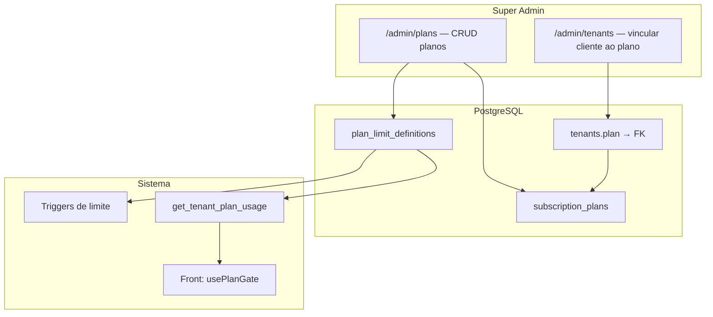

# Roadmap — limites de plano

## Dois eixos separados

| Eixo | Campo | Valores | Pergunta que responde |
|------|--------|---------|------------------------|
| **Status da campanha** | `tenants.status` | `active`, `suspended`, `pending`, `cancelled` | A campanha **pode usar o CRM**? |
| **Plano comercial** | `tenants.plan` | `trial`, `basic`, `pro`, `enterprise` | **O que** a campanha pode fazer (limites)? |

Trial de produto = plano `trial`, não status. Novo cadastro: `status = suspended`, `plan = trial` (padrão no signup).

---

## Implementado (v1)

- Tabela `plan_limit_definitions` no PostgreSQL (fonte de verdade dos limites).
- Triggers em `supporters`, `team_invitations`, `tenant_members`, `poll_snapshots`.
- RPC `get_tenant_plan_usage` para o front.
- UX: Eleitores, Equipe, Pesquisas, Relatórios.
- Admin `/admin/tenants`: alterar **status** e **plano** por cliente (dropdowns).
- Admin `/admin/plans`: editar limites de cada plano com descrição de impacto por campo (RPC `list_plan_limit_definitions_admin` / `update_plan_limit_definition`).

## Adiado

- **maxRegions** — contagem de bairros distintos.
- Mensagens de upgrade / CTA comercial.
- Enforcement de export no servidor (v1 só front).

---

## Admin hoje vs admin futuro

### Hoje — `/admin/tenants`

O Super Admin já gerencia **por cliente**:

- **Status** → libera ou bloqueia o CRM (`active`, `suspenso`, etc.).
- **Plano** → define limites via `plan_limit_definitions` (`trial`, `basic`, `pro`, `enterprise`).

Os limites numéricos (500 apoiadores, 3 vagas…) **não** são editáveis na UI — estão na tabela SQL `plan_limit_definitions`. Alterar exige migration ou SQL manual.

### Futuro — `/admin/plans` (a validar)

Nova área no painel admin para **CRUD de planos comerciais**, sem redeploy:

#### Tela `/admin/plans` (proposta)

| Seção | Campos |
|-------|--------|
| Identidade | Nome exibido, slug (`trial`, `pro`…), descrição curta |
| Marketing | Lista de benefícios (bullets), ordem, visível no signup (sim/não) |
| Limites | max apoiadores, max equipe, export, pesquisas, regiões (futuro) |
| Comercial | Preço (informativo até billing), ativo/arquivado |

#### Impacto técnico (fase 2 billing)

1. Substituir enum `tenant_plan` por tabela `subscription_plans` (slug único).
2. `tenants.plan_id` FK → plano ativo do cliente.
3. `plan_limit_definitions` vira linha por plano ou colunas em `subscription_plans`.
4. Triggers leem limites via join `tenants → subscription_plans` (sem enum fixo).
5. Página pública de preços e signup listam planos `is_public = true`.
6. Auditoria: log de quem alterou plano/limites no admin.

#### O que **não** muda

- **Status** continua separado — criar plano não substitui ativar/suspender campanha.
- **RLS** e triggers continuam sendo a verdade; admin UI só grava configuração.

---

## Ordem sugerida de entrega

1. ~~Enforcement v1 (feito)~~
2. ~~Remover `trial` de `tenant_status` (feito)~~
3. ~~**Admin planos v1** — CRUD em `plan_limit_definitions` + UI (sem billing)~~
4. **Planos dinâmicos** — migrar enum → tabela + signup público
5. **Billing** — Stripe/webhook altera `status` + `plan` automaticamente
